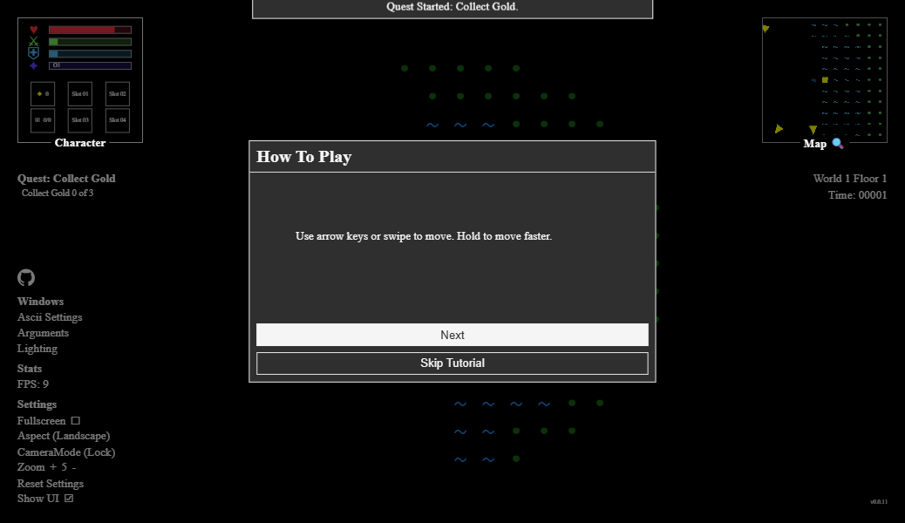

<!-- AI: Keep commands rooted at the repository. The Vite application, source, tests, and build output belong in ascii-rpg/. -->

# Ascii RPG

Ascii RPG is a Vite and React starter for a browser-based ASCII role-playing
game. The current baseline provides the safe-area shell, corner UI, fullscreen
preference, version display, and GitHub Pages deployment path.

## Images

### Screenshot

## Live Demo

- [Ascii RPG on GitHub Pages](https://samuelasherrivello.github.io/babylon-lite-ascii-rpg/)

## Table of Contents

1. [Images](#images)
2. [Live Demo](#live-demo)
3. [Collaborate](#collaborate)
4. [Possible Game Ideas](#possible-game-ideas)
5. [Getting Started](#getting-started)
6. [Project Details](#project-details)
7. [Credits](#credits)

## Collaborate

1. Clone [Ascii RPG](https://github.com/SamuelAsherRivello/babylon-lite-ascii-rpg)
   to work on the game locally.
2. Add shared reusable skills from the
   [AI Skills Library](https://github.com/SamuelAsherRivello/ai-skills-library).

## Getting Started

<!-- AI: Update this getting-started summary when the template is used. -->
Install Node.js 24 or a compatible current Node.js release, then run these
commands from the repository root:

### 🛠 Build Project

1. Run `npm install`.
2. Run `npm run build`.

### 🛠 Run Project

1. Run `npm run dev` and open the localhost URL Vite prints.
2. Run `npm test` to execute the focused source checks.

### 🛠 Release Version

1. Run `npm test` and `npm run build` from the repository root.
2. Push to `main` to run the GitHub Pages deployment workflow.
3. Verify the deployed Pages URL after the workflow completes.

## Workflows

## 🕹️ 1. Choose new feature

There are many cool ideas! Here is a partial list.

- [Possible Game Mechanics](ascii-rpg/documentation/inspiration/ideas.md)

### 🕹️ 2. Implement 

Here is an [openspec](openspec/) workflow for collaboration with minimal code conflicts. See this 30-second [video short](https://www.youtube.com/shorts/lce1edytViI). 

| # | Name | Command | Comment |
| --- | --- | --- | --- |
| -  | (Git Synchronize)  | - | Share progress |
| 1 | Explore | `$openspec-explore` | (Optional) Brainstorm possibilities. |
| 2 | Propose | `$openspec-propose` | Creates one focused feature change. |
| 3 | Refine | `$openspec-grill-me {n}` | (Optional) Clear doubts via {n} multi-choice questions |
| -  | (Git Synchronize)  | - | Share progress |
| 4 | Apply | `$openspec-apply-change` | Implements and completes one change. |
| 5 | Sync | `$openspec-sync-specs` | Updates main specs without archiving. |
| 6 | Archive | `$openspec-archive-change` | Finalizes and archives a change. |
| -  | (Git Synchronize)  | - | Share progress |

## Project Details

<!-- AI: Update these project details when the template is used. -->
Ascii RPG uses React for the UI and Vite for local development and production
builds. The application targets modern desktop and mobile browsers.

### 📦 AI

- `AGENTS.md` contains repository-specific AI agent guidance.
- [openspec](openspec/) contains the repository's specification workflow
  configuration.

### 📦 Packages

- [Vite](https://vite.dev/) provides local development and production builds.

### 📝 Structure

- `ascii-rpg/index.html` provides the HTML shell and application layers.
- `ascii-rpg/src/` contains the React entry point and styles.
- `ascii-rpg/test/` contains focused automated checks for the starter.
- `ascii-rpg/documentation/` contains canonical README images.
- `.github/workflows/deploy-pages.yml` builds and deploys the browser demo.

## Credits

<!-- AI: Preserve established attribution and ownership. Customize the following subsections only from confirmed contributor, contact, and license information; do not infer a new owner from the repository name. -->
### 💡 Contributors

<!-- AI: Preserve existing contributor credit and add contributors only when confirmed. Do not automatically advance experience counts or their reference year. -->
- Samuel Asher Rivello - Over 25 years of game development XP (2026)

### 💡 Contact

<!-- AI: Preserve confirmed contact destinations and their order unless requested otherwise. Use readable display URLs without a protocol or trailing slash while keeping the real link target intact. Do not invent accounts or change target capitalization based on display styling. -->
- [LinkedIn.com/in/SamuelAsherRivello](https://Linkedin.com/in/SamuelAsherRivello) ⭐ 
- [GitHub.com/SamuelAsherRivello](https://github.com/SamuelAsherRivello/)
- [Twitter.com/srivello](https://twitter.com/srivello/)
- Resume / Portfolio: [SamuelAsherRivello.com](http://www.SamuelAsherRivello.com)

### 💡 License

<!-- AI: Keep the license name linked to the actual relative license file and verify that its terms match this statement. Keep the copyright holder and year consistent with that file. Do not change license terms, ownership, or dates without an explicit request. -->
- Provided as-is under the [MIT License](LICENSE).

- Copyright © 2026 Rivello Multimedia Consulting, LLC.
